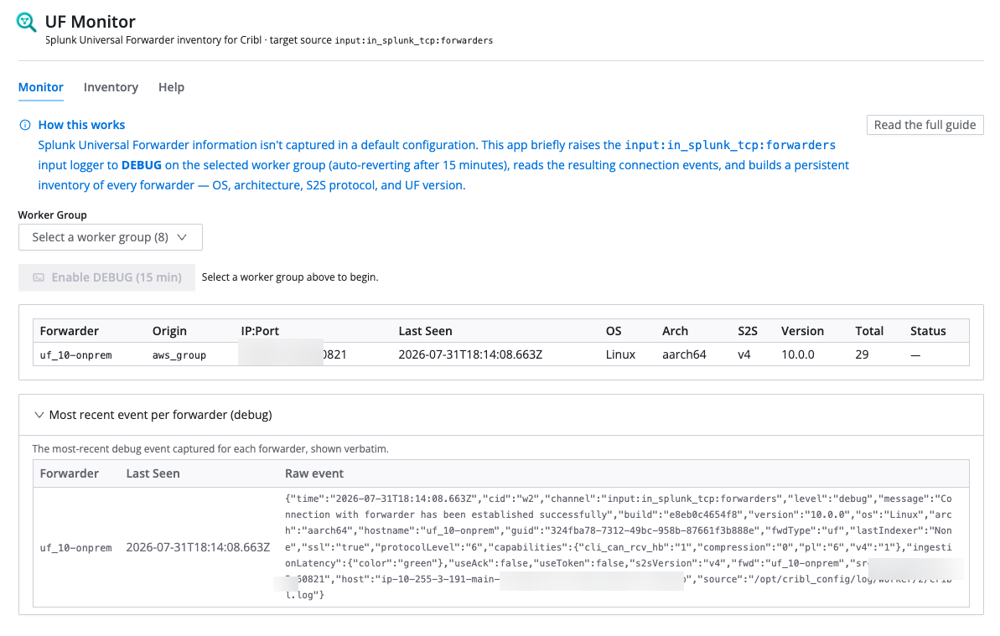

# UF Monitor

[](https://github.com/Cribl-Community/cc-uf-monitor/actions/workflows/ci.yml)

A Cribl App that discovers **Splunk Universal Forwarders (SUFs)** connecting to your worker
groups and builds a persistent inventory of their versions, operating systems, architectures,
and S2S protocol — without leaving debug logging on permanently.



## Why

Splunk Universal Forwarder information isn't captured in a default configuration. The connection
metadata (UF version, OS, architecture, S2S protocol) is only emitted by the
`input:in_splunk_tcp:forwarders` input channel when it runs at **DEBUG** level. Running that
channel at DEBUG all the time is noisy and expensive, so operators normally never see this data.

UF Monitor automates the whole loop safely: it turns DEBUG on for a short, self-reverting window,
harvests the connection events, and persists a clean inventory you can browse, filter, and export.

## What it does

1. **Select a worker group.** On selection the app reads the current logger config. If DEBUG is
   already active on the forwarders channel, it adopts the remaining window instead of re-enabling.
2. **Enable DEBUG (with confirmation).** Patches `input:in_splunk_tcp:forwarders` to DEBUG with a
   15-minute TTL, then commits and deploys that change so worker processes pick it up.
3. **Read logs live.** Polls the group logs every few seconds, keeping only events that carry a
   `version` field — the reliable signal of a forwarder reporting its relevant metadata.
4. **Reconcile and persist.** Matches each forwarder against the KV-persisted inventory and marks it
   *new*, *updated*, or *unchanged*. The inventory is global across every worker group monitored.
5. **Revert automatically.** The DEBUG log level is set with a TTL, so it expires on its own when the
   window ends — the app doesn't patch the config back. An adopted window is likewise left to its own TTL.

The in-app **Help** tab documents the full workflow, the fields collected, and an FAQ.

## Features

- Worker-group picker with automatic detection/adoption of an in-progress DEBUG window
- Live-updating Monitor table with new/updated/unchanged status
- **Inventory** tab: a durable, global inventory backed by the app KV store
- Per-forwarder show/hide toggle (hidden rows are excluded from the Monitor view and CSV export)
- Per-forwarder delete (a deleted forwarder that is still connecting is re-discovered with a fresh count)
- **Download CSV** export of the visible inventory

## Installation

1. Log in to Cribl and then click on **Apps->View All**
2. Click **Add App->Import from Git**.
3. Paste the repo url and "latest" for the release tag.
4. Click **Import**.

## Development

```bash
npm install
npm run dev      # start the Vite dev server
npm run lint     # oxlint
npm run build    # type-check + production build
npm run package  # build + create build/<name>-<version>.tgz
```

## Releasing

Releases are cut by pushing a `v*` tag. The workflow at `.github/workflows/release.yml` runs
`npm ci`, lints, packages the app at the tag's version (the leading `v` is stripped, so
`v1.0.0` → `1.0.0`), and creates a GitHub Release with the built `.tgz` attached.

```bash
git tag v1.0.0
git push origin v1.0.0
```

Sanity-check before tagging:

```bash
npm ci && npm run lint && npm run package -- --version 1.0.0
ls build/*.tgz
```

Discard any local `package.json` version bump from the dry run — only the tagged commit matters to
CI. To retag, delete the bad tag locally and on the remote first:

```bash
git tag -d v1.0.0
git push origin :refs/tags/v1.0.0
```

## License

Licensed under the [Apache License 2.0](./LICENSE).
